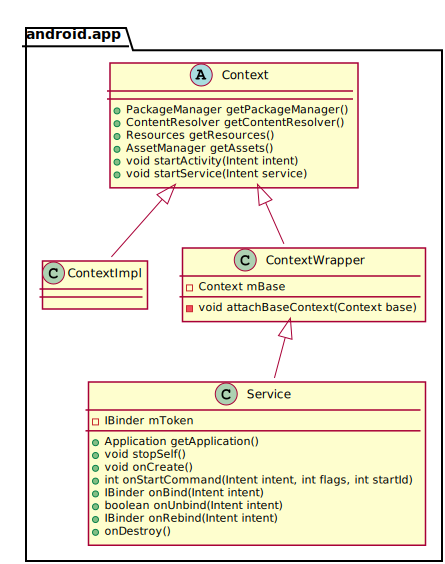
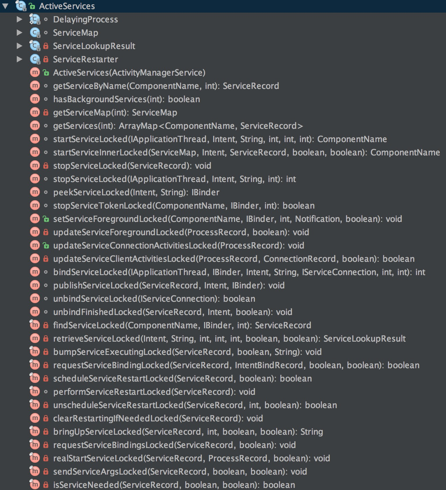
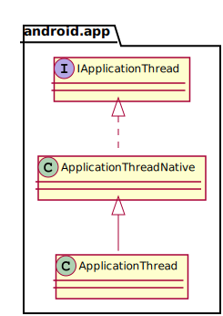

# Service源码分析
---


  ## 理解Service
  Service是Android四大组件之一。在一般的App开发场景中，它的存在往往是为了保证App切换到后台后，仍然具备处理数据的能力。Service实现了一套异步的跨进程通信模型，通过`Binder`机制，Service可以优雅的屏蔽跨进程调用的复杂性。一般来说，一个普通的Service运行在*当前进程的主线程中*，也就是说，如果不开辟线程，把耗时的操作直接甩在Service，那么系统就会赏你一个`ANR`（application Not Responding）警告。当然，为了方便做耗时操作，SDK层也提供了`IntentService`，它开辟了一个Work Thread来顺序处理耗时请求，从而避免了阻塞主进程。
  
  ## Service的本质
  Service家族的体系如图所示：
   
   
   `Service`是`Context`的子类，因此具备了`资源访问`和`组件调用`的能力，除此之外，它还具有独立的`生命周期`。
   
   按**运行环境**分类，Service可分为：
   * 前台Service
   * 后台Service
   
  #### 前台Service：
  通过调用 **Service.startForeground(int id, Notification notification)** 可以使一个后台Service成为前台Service，并与一个Notification`绑定`，显示在通知栏。前台Service与后台Service相比，它所在的进程具有更高的`优先级`，在内存不足时更不容易被系统Kill。
  
  #### 后台Service：
  后台Service是指当前没有显示任何界面的Service，处于非前台的Service皆为后台Service，后台Service的优先级低于前台Service，因此在低内存的时候，系统会优先杀掉后台Service。
   
   Service的本身只是一个`空壳`，它是由系统来维护和管理的。因此想要弄清楚Service的工作原理，就得分析它的启动流程。
   
 ## Service启动流程分析
 Service在`客户端`的启动入口位于 `ContextImpl.startService(Intent intent)`，因此我们从它入手。
 
 **[--> android/app/ContextImpl.java]**
 ```java
     public ComponentName startService(Intent service) {
        //如果当前进程是system-server进程，
        //调用startService会通过Log打印警告信息。
        warnIfCallingFromSystemProcess();
        return startServiceCommon(service, mUser);
    }
 ```
 `startService` 通过调用 `startServiceCommon` 来完成余下的工作，其代码如下：
 ```java
 private ComponentName startServiceCommon(Intent service, UserHandle user) {
        try {
            //验证启动目标Service的Intent的合法性
            validateServiceIntent(service);
            //让Intent为跨进程调用做准备
            service.prepareToLeaveProcess();
            //调用ActivityManagerNative的startService，
            //这实际上是一个远程调用。
            ComponentName cn = ActivityManagerNative.getDefault().startService(
                mMainThread.getApplicationThread(), service,
                service.resolveTypeIfNeeded(getContentResolver()), user.getIdentifier());
            //根据调用结果做对应的处理
            if (cn != null) {
                if (cn.getPackageName().equals("!")) {
                    //不具备调用目标Service的权限
                    throw new SecurityException(
                            "Not allowed to start service " + service
                            + " without permission " + cn.getClassName());
                } else if (cn.getPackageName().equals("!!")) {
                    // 无法启动目标Service的处理
                    throw new SecurityException(
                            "Unable to start service " + service
                            + ": " + cn.getClassName());
                }
            }
            return cn;
        } catch (RemoteException e) {
            return null;
        }
    }
 ```
 `startServiceCommon` 首先验证启动目标Service的Intent的合法性，然后调用 `ActivityManagerNative.startService(...)` 来启动Service，最后做了收尾工作。我们接着来到 `ActivityManagerNative` 一探究竟：
 
 **[-->android/app/ActivityManagerNative.java]**
 ```java
  public ComponentName startService(IApplicationThread caller, Intent service,
            String resolvedType, int userId) throws RemoteException
    {
        Parcel data = Parcel.obtain();
        Parcel reply = Parcel.obtain();
        data.writeInterfaceToken(IActivityManager.descriptor);
        data.writeStrongBinder(caller != null ? caller.asBinder() : null);
        service.writeToParcel(data, 0);
        data.writeString(resolvedType);
        data.writeInt(userId);
        mRemote.transact(START_SERVICE_TRANSACTION, data, reply, 0);
        reply.readException();
        ComponentName res = ComponentName.readFromParcel(reply);
        data.recycle();
        reply.recycle();
        return res;
    }
 ```
 相信读者看一看代码就清楚，这是一个`RPC(Remote Procedure Call)`调用，只不过它不是AIDL生成的，而是手工实现的。不过还有个疑问，这里的**mRemote**是从哪里来的呢？我们定位到取得这个IBinder的位置：
 ```java
 private static final Singleton<IActivityManager> gDefault = new Singleton<IActivityManager>() {
        protected IActivityManager create() {
            IBinder b = ServiceManager.getService("activity");
            IActivityManager am = asInterface(b);
            return am;
        }
    };
 ```
 显然，这个`mRemote`是通过`ServiceManager`来维护的，它对应的是**ActivityManagerService**。`ActivityManagerService`运行在`system-server`进程，它实际上是一个`进程级别`的单例。我们接着分析`startService`在服务端的实现:
 
 **[-->com/android/server/am/ActivityManagerService.java]**
 ```java
     public ComponentName startService(IApplicationThread caller, Intent service,
            String resolvedType, int userId) {
        enforceNotIsolatedCaller("startService");
        // 拒绝包含可能造成内存泄露的文件描述符的Intent
        if (service != null && service.hasFileDescriptors() == true) {
            throw new IllegalArgumentException("File descriptors passed in Intent");
        }
        synchronized(this) {
            final int callingPid = Binder.getCallingPid();
            final int callingUid = Binder.getCallingUid();
            final long origId = Binder.clearCallingIdentity();
            ComponentName res = mServices.startServiceLocked(caller, service,
                    resolvedType, callingPid, callingUid, userId);
            Binder.restoreCallingIdentity(origId);
            return res;
        }
    }
 ```
 `ActivityManagerService`的`startService`被客户端调用后，首先对 Intent 进行检查，然后跳转到调用`mServices.startServiceLocked(...)`进行余下工作。这里的mService的类型是`ActiveServices`，它的作用是什么呢？我们来看看这个类包含了哪些函数：
 
 
 
 `ActiveServices`的作用显而易见了，它负责处理`Service的组件调用`和`维护Service的状态信息`。那么`startServiceLocked`做了哪些事情呢？我们来看代码：
 
 **[-->com/android/server/am/ActiveServices.java]**
 ```java
     ComponentName startServiceLocked(IApplicationThread caller,
            Intent service, String resolvedType,
            int callingPid, int callingUid, int userId) {

        final boolean callerFg;
        //检查调用方身份
        if (caller != null) {
            final ProcessRecord callerApp = mAm.getRecordForAppLocked(caller);
            //在ActivityManagerService中查询不到调用者，直接抛出异常。
            if (callerApp == null) {
                throw new SecurityException(
                        "Unable to find app for caller " + caller
                        + " (pid=" + Binder.getCallingPid()
                        + ") when starting service " + service);
            }
            //判断调用方是前台进程还是后台进程
            callerFg = callerApp.setSchedGroup != Process.THREAD_GROUP_BG_NONINTERACTIVE;
        } else {
            callerFg = true;
        }
        //检索匹配Service组件信息
        ServiceLookupResult res =
            retrieveServiceLocked(service, resolvedType,
                    callingPid, callingUid, userId, true, callerFg);
        //没有匹配到Service组件            
        if (res == null) {
            return null;
        }
        if (res.record == null) {
            //目标Service组的android:export属性为false
            return new ComponentName("!", res.permission != null
                    ? res.permission : "private to package");
        }
        
        ServiceRecord r = res.record;
        
        if (!mAm.getUserManagerLocked().exists(r.userId)) {
            //目标Service组件不存在于任何User
            Slog.d(TAG, "Trying to start service with non-existent user! " + r.userId);
            return null;
        }
        //Uri权限检查
        NeededUriGrants neededGrants = mAm.checkGrantUriPermissionFromIntentLocked(
                callingUid, r.packageName, service, service.getFlags(), null, r.userId);
        
        //如果目标的Service正在被请求重启，但还未重启，取消这个请求
        if (unscheduleServiceRestartLocked(r, callingUid, false)) {
            if (DEBUG_SERVICE) Slog.v(TAG, "START SERVICE WHILE RESTART PENDING: " + r);
        }
        r.lastActivity = SystemClock.uptimeMillis();
        r.startRequested = true;
        r.delayedStop = false;
        r.pendingStarts.add(new ServiceRecord.StartItem(r, false, r.makeNextStartId(),
                service, neededGrants));
        final ServiceMap smap = getServiceMap(r.userId);
        boolean addToStarting = false;
        if (!callerFg && r.app == null && mAm.mStartedUsers.get(r.userId) != null) {
            ProcessRecord proc = mAm.getProcessRecordLocked(r.processName, r.appInfo.uid, false);
            
            if (proc == null || proc.curProcState > ActivityManager.PROCESS_STATE_RECEIVER) {
            
                if (r.delayed) {
                    // 目标Service正在启动中，但还没有启动完成。
                    return r.name;
                }
                if (smap.mStartingBackground.size() >= mMaxStartingBackground) {
                    // 该进程有其它组件正在启动，等待它完成后再启动。
                    Slog.i(TAG, "Delaying start of: " + r);
                    smap.mDelayedStartList.add(r);
                    r.delayed = true;
                    return r.name;
                }
                addToStarting = true;
            } else if (proc.curProcState >= ActivityManager.PROCESS_STATE_SERVICE) {
                addToStarting = true;
            } 
        } 
        return startServiceInnerLocked(smap, service, r, callerFg, addToStarting);
    }
 ```
 这里解释一下`startServiceLocked`的工作流程。
 * 检查了调用者的身份，以防止`匿名组件攻击`。
 * 根据客户端传入的数据`检索`匹配的Service组件信息。
 * 如果检索成功，进一步检查客户端是否有权限调起目标Service。对于在`AndroidManifest.xml`将 `android:export标签`设为 **false**的 `Service`，只有调用者与目标Service包名相同并且uid相同时才允许调起。
 * 如果目标的Service正在被请求重启，但还未重启，取消这个请求。
 * 如果目标进程已经创建， 但进程有其它组件正在启动，等待它完成后再启动。

在完成以上流程后，它调用了`startServiceInnerLocked`来完成余下的工作：

```java
    ComponentName startServiceInnerLocked(ServiceMap smap, Intent service,
            ServiceRecord r, boolean callerFg, boolean addToStarting) {
        ProcessStats.ServiceState stracker = r.getTracker();
        if (stracker != null) {
            //跟踪Service的内存消耗
            stracker.setStarted(true, mAm.mProcessStats.getMemFactorLocked(), r.lastActivity);
        }
        r.callStart = false;
        synchronized (r.stats.getBatteryStats()) {
            //跟踪Service的耗电量
            r.stats.startRunningLocked();
        }
        //通知客户端进程启动Service
        String error = bringUpServiceLocked(r, service.getFlags(), callerFg, false);
        if (error != null) {
            //启动失败
            return new ComponentName("!!", error);
        }

        if (r.startRequested && addToStarting) {
            boolean first = smap.mStartingBackground.size() == 0;
            smap.mStartingBackground.add(r);
            //设定客户端Service启动超时的时间
            r.startingBgTimeout = SystemClock.uptimeMillis() + BG_START_TIMEOUT;
            if (first) {
                smap.rescheduleDelayedStarts();
            }
        } else if (callerFg) {
            smap.ensureNotStartingBackground(r);
        }

        return r.name;
    }
```
这个函数中，启动了对Service内存消耗和电量消耗的跟踪，然而到了最关键的一步：**调起目标客户端进程来启动Service**。它的逻辑实现在 `bringUpServiceLocked(...)`中，我们来到这个函数：

```java
private final String bringUpServiceLocked(ServiceRecord r,
            int intentFlags, boolean execInFg, boolean whileRestarting) {

        if (r.app != null && r.app.thread != null) {
            //目标Service已经启动
            sendServiceArgsLocked(r, execInFg, false);
            return null;
        }

        if (!whileRestarting && r.restartDelay > 0) {
            // 如果目标Service正在等待restart完成，什么都不用做，直接返回。
            return null;
        }
        //从正在重启的Service列表中移除目标Service
        if (mRestartingServices.remove(r)) {
            clearRestartingIfNeededLocked(r);
        }
        //目标Service不再是delayed状态
        if (r.delayed) {
           getServiceMap(r.userId).mDelayedStartList.remove(r);
            r.delayed = false;
        }
        // 确保目标Service所属的User处于started状态。
        if (mAm.mStartedUsers.get(r.userId) == null) {
            String msg = "Unable to launch app "
                    + r.appInfo.packageName + "/"
                    + r.appInfo.uid + " for service "
                    + r.intent.getIntent() + ": user " + r.userId + " is stopped";
            Slog.w(TAG, msg);
            bringDownServiceLocked(r);
            return msg;
        }

        //Service即将被启动，它所属的Package不能被停止。
        try {
            AppGlobals.getPackageManager().setPackageStoppedState(
                    r.packageName, false, r.userId);
        } catch (RemoteException e) {
        } catch (IllegalArgumentException e) {
            Slog.w(TAG, "Failed trying to unstop package "
                    + r.packageName + ": " + e);
        }
        
        //检查要启动的Service是否被隔离
        final boolean isolated = (r.serviceInfo.flags&ServiceInfo.FLAG_ISOLATED_PROCESS) != 0;
        final String procName = r.processName;
        ProcessRecord app;

        if (!isolated) {
            app = mAm.getProcessRecordLocked(procName, r.appInfo.uid, false);
            //目标进程已经创建
            if (app != null && app.thread != null) {
                try {
                    //该进程又多了一个正在运行的Package
                    app.addPackage(r.appInfo.packageName, r.appInfo.versionCode, mAm.mProcessStats);
                    //在客户端创建并启动目标Service
                    realStartServiceLocked(r, app, execInFg);
                    return null;
                } catch (RemoteException e) {
                    Slog.w(TAG, "Exception when starting service " + r.shortName, e);
                }
            }
        } else {
            app = r.isolatedProc;
        }

        //目标进程还未创建
        if (app == null) {
            //通过ActivityManagerService来创建目标进程，调用将阻塞到目标进程创建完成为止
            if ((app=mAm.startProcessLocked(procName, r.appInfo, true, intentFlags,
                    "service", r.name, false, isolated, false)) == null) {
                //运行到这里说明目标进程创建失败
                String msg = "Unable to launch app "
                        + r.appInfo.packageName + "/"
                        + r.appInfo.uid + " for service "
                        + r.intent.getIntent() + ": process is bad";
                Slog.w(TAG, msg);
                bringDownServiceLocked(r);
                return msg;
            }
            if (isolated) {
                r.isolatedProc = app;
            }
        }
        //将目标Service添加到 正在启动Service但未启动完成 的Service列表中
        if (!mPendingServices.contains(r)) {
            mPendingServices.add(r);
        }

        if (r.delayedStop) {
            r.delayedStop = false;
            if (r.startRequested) {
                stopServiceLocked(r);
            }
        }
        return null;
    }
```
这个函数又依次做了以下事情：
* 如果目标Service已经启动，直接`sendServiceArgsLocked(...)`并返回。
* 如果目标Service正在被重启，但未重启完成，直接返回。
* 从`正在重启的Service列表`中移除目标Service。
* 清除目标Service的`delayed状态`。
* 如果目标Service所属的User未处于`started状态`，则不允许启动目标Service。
* 判断目标Service所处的进程是否`已经创建`。
* 如果进程已经创建，通过 `realStartServiceLocked(...)` 通知客户端创建并启动目标Service。
* 如果进程还未创建，通过 `ActivityManagerService`的 `startProcessLocked(...)`来创建目标进程。
* 将目标Service添加到 正在启动Service但未启动完成 的Service列表中。

故真正创建和启动Service的逻辑在 `realStartServiceLocked`，我们来到这个函数：

```java
    private final void realStartServiceLocked(ServiceRecord r,
            ProcessRecord app, boolean execInFg) throws RemoteException {
        if (app.thread == null) {
            throw new RemoteException();
        }
        //填充ServiceRecord
        r.app = app;
        r.restartTime = r.lastActivity = SystemClock.uptimeMillis();

        app.services.add(r);
        bumpServiceExecutingLocked(r, execInFg, "create");
        mAm.updateLruProcessLocked(app, false, null);
        mAm.updateOomAdjLocked();

        boolean created = false;
        try {
            synchronized (r.stats.getBatteryStats()) {
                r.stats.startLaunchedLocked();
            }
            //确保目标App的Dex已经优化完成
            mAm.ensurePackageDexOpt(r.serviceInfo.packageName);
            app.forceProcessStateUpTo(ActivityManager.PROCESS_STATE_SERVICE);
            //通知客户端的ApplicationThread创建和启动目标Service
            app.thread.scheduleCreateService(r, r.serviceInfo,
                    mAm.compatibilityInfoForPackageLocked(r.serviceInfo.applicationInfo),
                    app.repProcState);
            r.postNotification();
            created = true;
        } catch (DeadObjectException e) {
            //在启动Service的过程中，目标进程突然挂了
            Slog.w(TAG, "Application dead when creating service " + r);
            mAm.appDiedLocked(app);
        } finally {
            if (!created) {
                app.services.remove(r);
                r.app = null;
                scheduleServiceRestartLocked(r, false);
                return;
            }
        }
        //如果Service需要绑定，则绑定目标Service
        requestServiceBindingsLocked(r, execInFg);

        updateServiceClientActivitiesLocked(app, null, true);

        if (r.startRequested && r.callStart && r.pendingStarts.size() == 0) {
            r.pendingStarts.add(new ServiceRecord.StartItem(r, false, r.makeNextStartId(),
                    null, null));
        }
        //通知客户端ApplicationThread调用目标Service的onStartCommand方法
        sendServiceArgsLocked(r, execInFg, true);

        if (r.delayed) {
 getServiceMap(r.userId).mDelayedStartList.remove(r);
            r.delayed = false;
        }

        if (r.delayedStop) {
            r.delayedStop = false;
            if (r.startRequested) {
                stopServiceLocked(r);
            }
        }
    }
```
代码比较简单，服务端首先填充ServiceRecord中关于目标Service的数据，一切无误后远程调用客户端的 `scheduleCreateService` 函数来创建目标Service。`scheduleCreateService` 函数位于 `android.app.IApplicationThread`接口。那么，它又是何物呢？我们来看看这个接口：

**[-->androiod/app/IApplicationThread.java]**
```java
/**
 * System private API for communicating with the application.  This is given to
 * the activity manager by an application  when it starts up, for the activity
 * manager to tell the application about things it needs to do.
 */
public interface IApplicationThread extends IInterface {
    //...
}
```
看注释就很清楚了，它是服务端与客户端通信的桥梁，每一个客户端进程都对应一个`IApplicationThread`，它的实例会在进程创建后传递到服务端，方便服务端与客户端通信。`IApplicationThread`接口的部分实现在 `android.app.ApplicationThreadNative`，它仍然是一个`抽象类`，但是实现了大部分接口中的方法：

**[-->androiod/app/ApplicationThreadNative.java]**
```java
public abstract class ApplicationThreadNative extends Binder
        implements IApplicationThread {
        
       static public IApplicationThread asInterface(IBinder obj) {
        if (obj == null) {
            return null;
        }
        IApplicationThread in =
            (IApplicationThread) obj.queryLocalInterface(descriptor);
        if (in != null) {
            return in;
        }
        return new ApplicationThreadProxy(obj);
    }
    //...   
}
```
真正完整的是`ApplicationThread`。它继承了 `ApplicationThreadNative` ，并实现了所有的抽象方法。它是 `android.app.ActivityThread` 的内部类：

**[-->androiod/app/ActivityThread.java]**

```java
    public final class ActivityThread {
        
        private class ApplicationThread extends ApplicationThreadNative {
        
            public final void scheduleCreateService(IBinder token,
                ServiceInfo info, CompatibilityInfo compatInfo, int processState) {
                //...
            }
            //...
        }
        //...
    }
```

它的家族体系如图所示：




由前面的分析可知，远程服务端最终会调用 `ApplicationThread。scheduleCreateService`，那么我们来看看`scheduleCreateService`是怎样实现的：

```java
        public final void scheduleCreateService(IBinder token,
                ServiceInfo info, CompatibilityInfo compatInfo, int processState) {
            //更新进程状态
            updateProcessState(processState, false);
            CreateServiceData s = new CreateServiceData();
            s.token = token;
            s.info = info;
            s.compatInfo = compatInfo;
            发送请求到Handler
            sendMessage(H.CREATE_SERVICE, s);
        }
```
`scheduleCreateService`中将传递进来的参数包装成了一个`CreateServiceData`，然后通过`sendMessage`传递到Handler。
这里的`sendMessage`的实现如下：
```java
    private void sendMessage(int what, Object obj, int arg1, int arg2, boolean async) {
        Message msg = Message.obtain();
        msg.what = what;
        msg.obj = obj;
        msg.arg1 = arg1;
        msg.arg2 = arg2;
        if (async) {
            msg.setAsynchronous(true);
        }
        mH.sendMessage(msg);
    }
```
因此，消息发送到的是`ActivityThread`中的`mH`。`mH`的类型为**H**，继承自Handler：
```java
private class H extends Handler {
          public static final int CREATE_SERVICE          = 114;
          //...
          public void handleMessage(Message msg) {
              switch(msg.what) {
                case CREATE_SERVICE:
                    Trace.traceBegin(Trace.TRACE_TAG_ACTIVITY_MANAGER, "serviceCreate");
                    handleCreateService((CreateServiceData)msg.obj);
                    Trace.traceEnd(Trace.TRACE_TAG_ACTIVITY_MANAGER);
                    break;
                //...
              }
          }

}
```
`mH`收到`what`为`CREATE_SERVICE`的Message后，通过 `handleCreateService`做后续处理：
  ```java
      private void handleCreateService(CreateServiceData data) {
        //停止空闲时自动触发GC的机制
        unscheduleGcIdler();
        //取得App对应的LoadedApk
        LoadedApk packageInfo = getPackageInfoNoCheck(
                data.info.applicationInfo, data.compatInfo);
        //创建Service        
        Service service = null;
        try {
            //通过反射来创建Service实例
            java.lang.ClassLoader cl = packageInfo.getClassLoader();
            service = (Service) cl.loadClass(data.info.name).newInstance();
        } catch (Exception e) {
            //...
        }

        try {
            //创建Service的base context
            ContextImpl context = ContextImpl.createAppContext(this, packageInfo);
            context.setOuterContext(service);
            //取得Application
            Application app = packageInfo.makeApplication(false, mInstrumentation);
            //填充信息到Service
            service.attach(context, this, data.info.name, data.token, app,
                    ActivityManagerNative.getDefault());
            service.onCreate();
            //将创建完成的Service放入mServices这个Map中
            mServices.put(data.token, service);
            try {
               //通知服务端，Service启动完成。 ActivityManagerNative.getDefault().serviceDoneExecuting(
                        data.token, SERVICE_DONE_EXECUTING_ANON, 0, 0);
            } catch (RemoteException e) {
                // nothing to do.
            }
        } catch (Exception e) {
            //...
        }
    }
  ```
  代码十分清晰，这个函数做了以下事情：
  * 根据`ServiceInfo`中的`ApplicationInfo`取得App对应的LoadedApk。
  * 通过`LoadedApk`拿到`ClassLoader`来反射创建目标Service实例。
  * 通过`ContextImpl.createAppContext(...)`来创建base context。前面分析过，Service继承自**ContextWrapper**，它的`attachBaseContext`方法传入的就是这里的`context`。
  * 填充信息到Service，这样Service才能知道自己的身份。
  * 调用`Service.onCreate`方法。
  * 将创建完成的Service放入`mServices`这个 Map 中。
  * 通知服务端，Service启动完成。如果前面的过程耗时太长，服务端会认为客户端的Service启动失败。

## 总结
还记得这句话吗？
> Read the fucking source code !!!

本文试图通过对`Service启动流程的源码分析`来诠释这句话。文章中没有分析`bindService`、`unbindService`、`stopService`。因为`startService`的流程与其它三个函数的思想是完全一致的，读者完全可以举一反三。当然，对`bindService`的机制有兴趣的同学，也可以阅读[ Binder 源码分析 ](https://github.com/xdtianyu/SourceAnalysis/blob/master/Binder%E6%BA%90%E7%A0%81%E5%88%86%E6%9E%90.md)这篇文章，理解其中的内容一定会给你带来无尽的收获！
